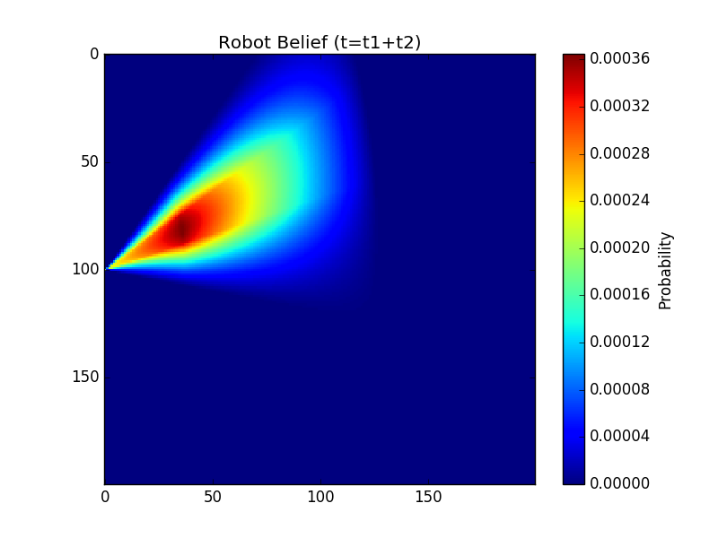

# sc635-assignments
SC635 [Advanced Topics in Mobile Robotics], Spring 2021

### Topics
- [week1](week1_170100025_16d070043): Intro to ROS Nodes and Topics
- [week2](week2_170100025_16d070043): Implement controller for Kobo robot for trajectory tracking using pose obtained from wheel encoders
- [week3](week3_170100025_16d070043): Trajectory tracking using pose derived from only trilateration data (with high noise)
- [week4](week4_170100025_16d070043): Histogram based belief propagation using only the velocity motion model
- [week5](week5_170100025_16d070043): Trajectory tracking using pose obtained by applying the Extended Kalman Filter on trilateration data and noisy wheel encoder data

### Demo Images
The Kobo robot starts at the center of the circle. Blue dots are trajectory waypoints. Cyan line is the actual trajectory travelled by the robot.

 
    

  
Above trajectory is using only the very noisy trilateration data

 
      

  
Above trajectory is using EKF on trilateration data and noisy wheel encoder data

 
      

  
Above is the belief propagation using only probabilistic motion model for a linear motion followed by arc motion. Higher probabilities are indicative of where the robot is more likely to be.

### Authors

* **Siddharth Saha** - [trunc8](https://github.com/trunc8)
* **Kumar Ashutosh** - [thechargedneutron](https://github.com/thechargedneutron)

Created with :heart: by <a href="https://www.linkedin.com/in/sahasiddharth611/">Siddharth</a>

